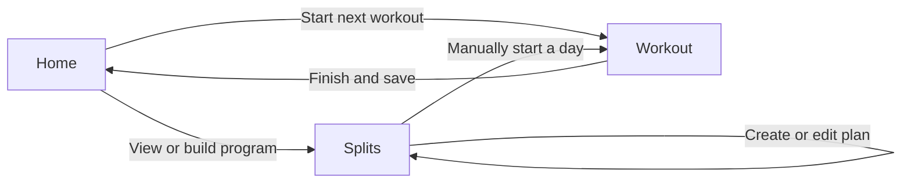

# IRON Screen Storyline

This document defines what each screen is responsible for and how users move through the app. It is a living product contract: update it when a workflow changes so the UI, database, and navigation continue to describe the same product.

## Core user storyline



Home answers **“What should I do now?”** Splits answers **“What is my training plan?”** Workout will answer **“What am I doing in this session?”**

## Shared product rules

- A split is a reusable training plan. A workout is one performed session from that plan.
- Split days use an ordered rotation. They are not controlled by the current weekday.
- Missing a planned day does not skip a workout. If Pull is next, Pull remains next until it is completed or the user deliberately starts another day.
- Preferred weekdays and a weekly target may guide the user, but they do not determine the rotation.
- An exercise represents a movement on specific equipment. Machine-specific histories must remain separate.
- Hardcoded data is acceptable while building the UI. It should eventually enter screens through typed data objects rather than being scattered through JSX.

---

## 1. Home

### Purpose

Home is the daily launch screen. It summarizes recent activity and makes the next useful action obvious.

### User questions answered

- What workout comes next?
- Did I train on the days I expected this week?
- What is my recent training volume?
- Have I recently set any personal records?

### Screen sections

1. **Greeting and profile**
   - Greeting based on the time of day.
   - User display name.
   - Profile/settings action.

2. **This week**
   - Seven-day strip showing completed workout days.
   - Today is visually highlighted.
   - This is a compact recent-activity summary, not the full consistency report.

3. **Next workout**
   - Next split day in the current rotation.
   - Target muscle groups.
   - Exercise and planned-set counts.
   - Primary **Start Workout** action.

4. **Quick stats**
   - Current workout streak.
   - Training volume for the current week.
   - Personal records set this week.

5. **Recent personal records**
   - Exercise name.
   - Gym and equipment identity.
   - Previous and new performance.
   - **View All** leads to the relevant history/progression view.

### Primary flow

```text
Open app
  → Review next workout
  → Tap Start Workout
  → Open a draft of the next split day
```

The draft receives:

- The current split ID and split-day ID.
- Exercises in their saved order.
- Equipment and gym assignment for each exercise.
- Planned sets and rep ranges.
- Most recent machine-specific performance.

### Secondary flows

- Tap the profile image → open profile/settings later.
- Tap the weekly activity strip → open History later.
- Tap View All beside recent PRs → open Progression or filtered History later.
- Navigate to Splits → inspect or modify the training plan.

### State rules

- The “next workout” advances only after a workout is saved successfully.
- Abandoning or deleting a draft does not advance the rotation.
- Starting a different split day manually does not silently reorder the split.
- Home stats come from completed workout logs, never from unfinished drafts.

### Empty state

If the user has no split:

```text
No program yet
Build your first split to start logging workouts.
[CREATE A SPLIT]
```

The button opens the new-split workflow.

---

## 2. Splits

### Purpose

Splits is the program-management screen. Users create the structure that Workout will later execute.

### User questions answered

- What training plan am I following?
- What days are in the plan, and in what order?
- Which muscle groups and exercises belong to each day?
- What equipment, rep range, and set target does each exercise use?
- How frequently do I intend to train?

### Main screen

The selected split displays:

- Split name, such as Push Pull Legs.
- Number of training days.
- Target sessions per week.
- Ordered split-day cards.
- **New Split** action.

Each split-day card displays:

- Day name.
- Target muscle groups.
- Exercise count.
- Optional preferred weekdays.
- Expand/collapse action.

Expanding a day previews its exercises in order. The main card should prioritize **View / Edit** over **Start** because starting the expected workout belongs on Home.

A secondary **Start This Day** action may remain inside the expanded card for users intentionally training out of rotation.

### Create-split flow

```text
Splits
  → New Split
  → Choose template or Custom
  → Name split
  → Add and order training days
  → Add and order exercises
  → Configure each exercise
  → Review
  → Save
```

#### Step 1: Choose a starting point

- Push / Pull / Legs
- Upper / Lower
- Full Body
- Arnold
- Bro Split
- Freestyle
- Custom

Templates create editable starting data. They are not permanent rules.

#### Step 2: Define split details

- Split name.
- Ordered training days.
- Target sessions per week.
- Optional preferred weekdays for planning or reminders.

The ordered rotation remains the source of truth for the next workout.

#### Step 3: Configure each training day

- Day name.
- Exercise order.
- Add, remove, or reorder exercises.

#### Step 4: Configure each exercise

- Movement.
- Gym.
- Specific machine or equipment label.
- Minimum and maximum reps.
- Planned number of working sets.

Example:

```text
Incline Chest Press
Machine #3 — Gold's Gym
3 working sets
8–12 reps
```

#### Step 5: Review and save

Validate before saving:

- The split has a name.
- At least one day exists.
- Each day has at least one exercise.
- Minimum reps do not exceed maximum reps.
- Each exercise has an equipment assignment.

After saving:

- Make the split available as the active plan.
- Set its first day as the next workout unless the user is editing an existing active split.
- Return to the Splits overview.

### Edit flow

```text
Expand day
  → Edit Day
  → Change name, order, exercises, equipment, sets, or rep ranges
  → Save
```

Edits affect future workout drafts. Previously completed workouts keep their original logged data.

### Delete rules

- Deleting a split or day requires confirmation.
- Completed workout history must not be deleted with the plan.
- If the active split is deleted, Home returns to the no-program state.

### Out of scope for the initial split workflow

- Periodized training blocks or mesocycles.
- Deload scheduling.
- Automatically changing the user’s program.
- Calendar rules that skip rotation days.

---

## 3. Workout

Workout receives a split-day snapshot and turns it into a loggable session.

Inputs already decided:

- Split and split-day identity.
- Ordered exercises.
- Equipment identity per exercise.
- Planned sets.
- Rep range.
- Last machine-specific performance.
- Whether the workout was started from Home or manually from Splits.

### Interaction model

Workout behaves like an exercise pager. It shows one exercise at a time so the highest-frequency controls remain large and easy to use at the gym.

```text
Session overview
  → Exercise 1
      → Log set
      → Rest timer
      → Log remaining sets
      → Done with exercise
  → Exercise 2
  → Continue through remaining exercises
  → Review workout
  → Save
```

This should feel like a slideshow without trapping the user in a strict linear flow:

- **Previous** returns to an earlier exercise without losing data.
- **Next** or **Done** advances to the next exercise.
- **Workout Overview** opens the full exercise list at any time.
- Exercises display completed, active, skipped, and not-started states.
- Selecting an exercise from the overview jumps directly to it.
- Swiping may mirror Previous and Next, but visible buttons remain the primary controls to prevent accidental navigation.

### Exercise page

Each exercise page shows:

- Exercise position, such as Exercise 2 of 6.
- Exercise name.
- Gym and specific equipment label.
- Target sets and rep range.
- Last machine-specific performance.
- Rows for weight, reps, and RIR.
- Add Set action.
- Optional exercise notes.
- Rest timer.
- Previous and Done / Next controls.

Each set row has an explicit completion action. Entering numbers alone does not mark a set complete.

### Completing a set

```text
Enter weight, reps, and RIR
  → Mark set complete
  → Persist the draft locally
  → Start rest timer
  → Prepare the next set using the previous values
```

- Weight and reps are required.
- RIR is required for the progression engine but can initially allow “Not sure” if the team wants a lower-friction onboarding path.
- A completed set can still be edited.
- Editing a completed set recalculates its estimated 1RM when the workout is saved.

### Rest timer

The timer starts automatically after a set is marked complete. It appears as a compact persistent control so the user can inspect another exercise or leave the phone screen without losing the countdown.

Recommended defaults:

- **Compound exercise:** 3 minutes.
- **Isolation exercise:** 2 minutes.
- **Per-exercise override:** saved with the exercise.
- **During-workout adjustment:** add 30 seconds, subtract 30 seconds, skip, or restart.

The timer is guidance, not a gate. The user may begin the next set before it ends or continue resting after it reaches zero. It should use a local notification or haptic alert when supported.

These defaults intentionally avoid prescribing one short “hypertrophy timer.” Research has found that longer rest can preserve volume and may improve hypertrophy compared with one-minute intervals, while more recent synthesis suggests any benefit above roughly 60 seconds is likely small. The product should therefore provide practical defaults and let the user adjust them rather than claiming one universally optimal duration.

Research references:

- [Longer Interset Rest Periods Enhance Muscle Strength and Hypertrophy in Resistance-Trained Men](https://pubmed.ncbi.nlm.nih.gov/26605807/)
- [Give it a rest: a systematic review with Bayesian meta-analysis on inter-set rest and hypertrophy](https://pubmed.ncbi.nlm.nih.gov/39205815/)

### Completing an exercise

The Done action becomes primary after all planned sets are completed. If sets are incomplete, tapping Done asks whether the user wants to:

- Return and complete them.
- Mark the remaining sets skipped.
- Continue with the exercise partially completed.

Advancing preloads the next exercise immediately. The completed exercise remains editable through Previous or Workout Overview.

### Session overview

The overview shows:

- Elapsed workout time.
- Completed sets versus planned sets.
- Every exercise and its current state.
- Add Exercise action.
- Reorder action for the current session.
- Finish Workout action.

Changing the current session does not automatically edit the reusable split. A separate action can offer to apply the same change to future workouts.

### Draft recovery

- Persist the draft after every completed or edited set.
- Reopening the app returns to the active workout.
- Leaving the workout asks whether to keep or discard the draft.
- Only one active workout is allowed in the MVP.

### Finish and save

```text
Finish Workout
  → Review exercises and sets
  → Resolve invalid or incomplete entries
  → Add optional session notes
  → Save workout and sets together
  → Advance split rotation after successful save
  → Return Home
```

The save must be atomic: either the workout and all valid sets are stored, or the operation reports failure and keeps the local draft. The next split day advances only after a successful save.

### Remaining product decisions

- Whether RIR is strictly required for every working set.
- Whether warm-up sets are supported in the MVP and excluded from progression calculations.
- Whether a manually started out-of-rotation workout advances the rotation.
- Whether supersets need first-version support or can wait.
